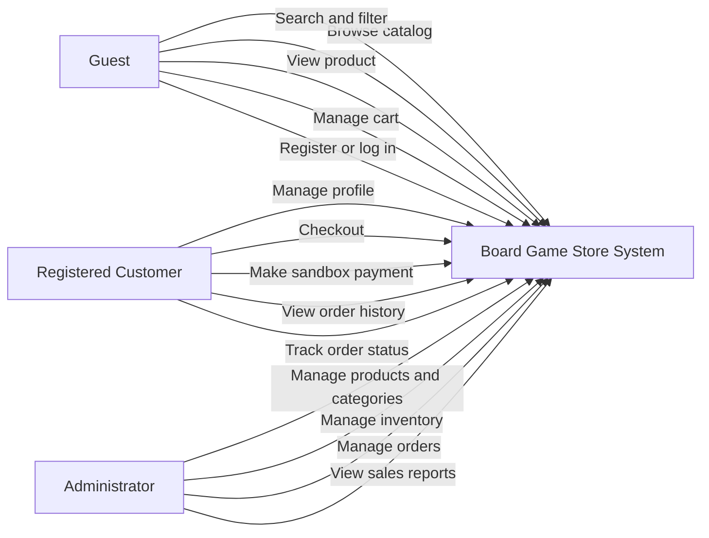
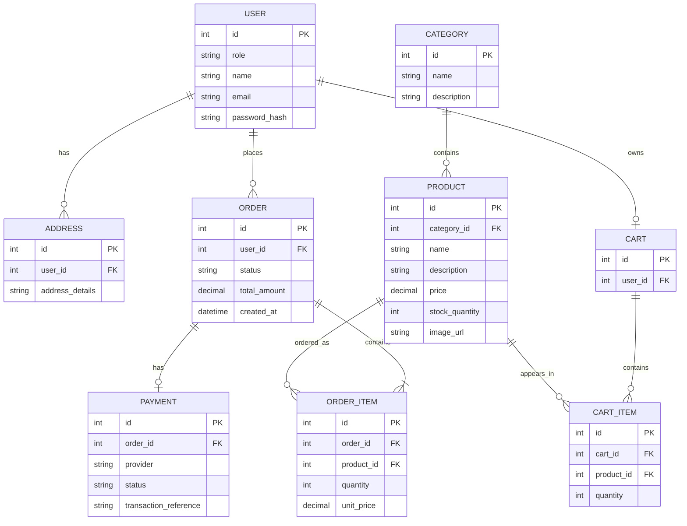
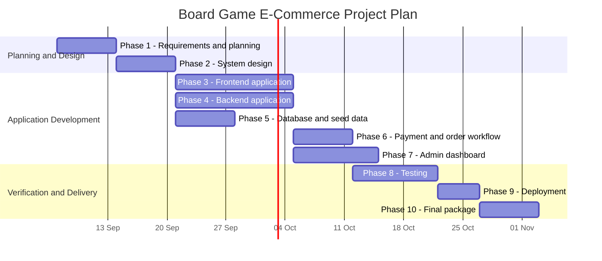

# Phase 1: Requirements and Planning

## 1. Document Purpose

This document defines the initial requirements and plan for a full-stack e-commerce website for selling board games. It is based on the approved project proposal and technology stack.

Items marked **Proposed for review** are design decisions needed to complete the phase and are not treated as final until approved.

## 2. Project Goal

The goal is to design, build, test, and deploy a complete e-commerce website that allows customers to browse and purchase board games, while administrators manage products, stock, orders, and basic sales information.

The final system must be a working application rather than a static design or partial prototype.

## 3. Confirmed Technology Stack

| Layer | Technology |
|---|---|
| Frontend | React |
| Backend | Node.js + Express |
| Database | MySQL |
| Authentication | JWT + bcrypt |
| Payment | Stripe test mode |
| Version control | Git + GitHub |
| Deployment | Vercel, Render, and a MySQL cloud provider |

## 4. Actors and Roles

### 4.1 Guest

A visitor who has not logged in.

A guest can:

- Browse the product catalog
- Search and filter products
- View product details
- Add products to a shopping cart
- Begin checkout
- Register or log in

### 4.2 Registered Customer

A customer with an account.

A registered customer can:

- Log in and log out
- Manage their profile
- Browse and search products
- Manage a shopping cart
- Complete checkout
- View order confirmation
- View order history
- Track order status

### 4.3 Administrator

An authorized staff user who manages the store.

An administrator can:

- Log in securely to the admin area
- Create, edit, and delete products
- Create, edit, and delete categories
- Manage stock levels
- View and update orders
- View basic sales analytics and reports

## 5. Functional Requirements

### 5.1 Customer Storefront

- The system shall allow guests and customers to browse a product catalog.
- The system shall organize products into categories.
- The system shall allow users to search for products.
- The system shall allow users to filter products.
- The system shall display product images, prices, descriptions, and stock status.
- The system shall allow users to add products to a cart.
- The system shall allow users to update quantities and remove cart items.
- The system shall preserve the cart across sessions as required by the approved design.
- The system shall allow users to register, log in, and log out.
- The system shall allow registered customers to manage their profiles.
- The system shall provide a checkout flow with shipping details and a payment step.
- The system shall process payments through Stripe test mode.
- The system shall show an order confirmation after a successful order.
- The system shall provide order history for registered customers.
- The system shall display order status information to customers.

### 5.2 Administration

- The system shall provide secure administrator login.
- The system shall restrict admin functions to authorized administrators.
- The system shall provide product CRUD operations.
- The system shall provide category CRUD operations.
- The system shall allow administrators to manage stock levels.
- The system shall allow administrators to view orders.
- The system shall allow administrators to update order status.
- The system shall support a basic order fulfillment workflow.
- The system shall provide basic sales analytics, such as orders per period and top products.

### 5.3 Order and Payment Workflow

- The system shall validate checkout information before creating an order.
- The system shall create an order from the confirmed cart contents.
- The system shall record the payment result returned by the sandbox payment provider.
- The system shall provide an order confirmation and receipt or invoice output.
- The system shall prevent unavailable stock from being purchased.

## 6. Non-Functional Requirements

### 6.1 Security

- Passwords shall be hashed using bcrypt or an equivalent secure password-hashing method.
- The backend shall validate incoming data on the server.
- The application shall protect against SQL injection through safe database access practices.
- The application shall reduce XSS risk through safe output handling and input validation.
- JWTs shall be handled securely.
- Authorization shall prevent customers from accessing administrator functions.
- Payment credentials and other secrets shall not be stored in source code.

### 6.2 Performance

- Product and category queries shall use efficient database queries.
- The application shall provide reasonable page-load times.
- The backend shall return clear errors instead of failing silently.

### 6.3 Responsiveness

- The storefront shall be usable on desktop, tablet, and mobile screen sizes.
- Key customer pages shall remain usable at small viewport widths.
- The admin area shall support the required management workflows on supported screen sizes.

### 6.4 Maintainability

- The source code shall be organized into logical frontend and backend modules.
- The project shall use clear naming and consistent formatting.
- Important setup, API, and usage decisions shall be documented.
- Git commits shall describe meaningful project milestones.

### 6.5 Reliability and Testing

- The project shall include unit tests.
- The project shall include integration tests.
- Testing results and identified bugs shall be documented.
- The deployed application shall be verified end-to-end before final submission.

## 7. Core Use Cases

The following diagram shows the confirmed high-level interactions.

## 8. Proposed Initial Data Model

This is a proposed baseline for the ERD. It is derived from the confirmed features and requires review before database implementation.

### 8.1 Data Model Notes

- `USER.role` distinguishes customer and administrator access.
- `ORDER_ITEM.unit_price` preserves the price at the time of purchase.
- `PRODUCT.stock_quantity` supports inventory tracking.
- `PAYMENT` records the result of the Stripe test-mode payment.
- The exact address fields, product attributes, and order statuses require approval before implementation.

## 9. Project Timeline

The following timeline follows the required phases. Exact calendar dates will be added after the project deadline and review schedule are provided.

The dates above are a provisional working schedule and must be replaced or approved once the academic submission deadline is known.

## 10. Open Decisions for Approval

These points were not specified in the proposal and must be confirmed before Phase 1 is finalized:

1. Store name and branding.
2. Product categories used by the workplace.
3. Product fields required beyond name, description, price, image, category, and stock.
4. Exact order status values and fulfillment steps.
5. Whether guest checkout is allowed or customers must register before checkout.
6. Whether a customer can save multiple shipping addresses.
7. Exact Stripe receipt or invoice requirements.
8. Academic deadline and dates for phase reviews.

## 11. Phase 1 Approval Checklist

- [ ] Product catalog structure approved
- [ ] User roles approved
- [ ] Core use cases approved
- [ ] Functional requirements approved
- [ ] Non-functional requirements approved
- [ ] ERD baseline approved
- [ ] Timeline approved

Phase 2 should begin only after the Phase 1 decisions and checklist have been reviewed and approved.
