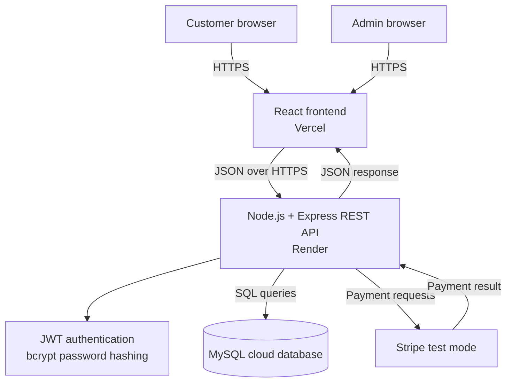

# Phase 2: System Design Package

## 1. Purpose

This document translates the Phase 1 requirements into a proposed technical design for the board-game e-commerce website.

The design uses the approved stack:

- React frontend
- Node.js and Express backend
- MySQL database
- JWT authentication
- bcrypt password hashing
- Stripe test mode
- Vercel, Render, and a MySQL cloud provider for deployment

The design is intentionally modular so that the frontend, backend, and database can be developed and tested separately.

## 2. System Architecture

The system uses a three-layer architecture:

1. The React client presents pages and sends HTTPS requests.
2. The Express API validates requests, authenticates users, applies business rules, and communicates with external services.
3. MySQL stores application data, while Stripe handles sandbox payment processing.



### 2.1 Backend Responsibilities

The Express API will be divided into logical modules:

- `auth`: registration, login, JWT verification, and role authorization
- `users`: customer profile operations
- `catalog`: categories, products, search, and filtering
- `cart`: cart retrieval and item changes
- `orders`: checkout, order creation, history, and status
- `payments`: Stripe test-mode payment requests and results
- `admin`: protected product, category, inventory, order, and report operations

### 2.2 Request Flow

1. A user opens a React page.
2. React requests data from the Express API.
3. Public requests are handled without authentication.
4. Protected requests include a JWT in the authorization header.
5. The API verifies the JWT and checks the user's role when required.
6. The API validates the request data.
7. The API reads or changes MySQL data.
8. The API returns a consistent JSON response.

## 3. Normalized Database Design

The database is relational and designed to avoid repeating groups and duplicated business data.

### 3.1 Relationships

```mermaid
erDiagram
    USERS ||--o{ ADDRESSES : has
    USERS ||--o{ ORDERS : places
    USERS ||--o| CARTS : owns
    CATEGORIES ||--o{ PRODUCTS : contains
    PRODUCTS ||--o{ PRODUCT_IMAGES : has
    CARTS ||--o{ CART_ITEMS : contains
    PRODUCTS ||--o{ CART_ITEMS : appears_in
    ORDERS ||--|{ ORDER_ITEMS : contains
    PRODUCTS ||--o{ ORDER_ITEMS : referenced_by
    ORDERS ||--|| ORDER_ADDRESSES : uses
    ORDERS ||--o| PAYMENTS : has

    USERS {
        int id PK
        varchar role
        varchar name
        varchar email UK
        varchar password_hash
        datetime created_at
        datetime updated_at
    }
    ADDRESSES {
        int id PK
        int user_id FK
        varchar recipient_name
        varchar line_1
        varchar line_2
        varchar city
        varchar postal_code
        varchar country
    }
    CATEGORIES {
        int id PK
        varchar name UK
        varchar description
        datetime created_at
        datetime updated_at
    }
    PRODUCTS {
        int id PK
        int category_id FK
        varchar name
        text description
        decimal price
        int stock_quantity
        boolean is_active
        datetime created_at
        datetime updated_at
    }
    PRODUCT_IMAGES {
        int id PK
        int product_id FK
        varchar image_url
        boolean is_primary
    }
    CARTS {
        int id PK
        int user_id FK UK
        datetime created_at
        datetime updated_at
    }
    CART_ITEMS {
        int id PK
        int cart_id FK
        int product_id FK
        int quantity
    }
    ORDERS {
        int id PK
        int user_id FK
        varchar status
        decimal total_amount
        datetime created_at
        datetime updated_at
    }
    ORDER_ITEMS {
        int id PK
        int order_id FK
        int product_id FK
        int quantity
        decimal unit_price
    }
    ORDER_ADDRESSES {
        int id PK
        int order_id FK UK
        varchar recipient_name
        varchar line_1
        varchar line_2
        varchar city
        varchar postal_code
        varchar country
    }
    PAYMENTS {
        int id PK
        int order_id FK UK
        varchar provider
        varchar provider_reference
        varchar status
        decimal amount
        datetime created_at
    }
```

### 3.2 Table Design

| Table | Purpose | Important rules |
|---|---|---|
| `users` | Stores customer and administrator accounts | Email is unique; role controls authorization |
| `addresses` | Stores reusable customer shipping addresses | Each address belongs to one user |
| `categories` | Stores product categories | Category names are unique |
| `products` | Stores the catalog and current inventory | Price and stock are stored as numeric values |
| `product_images` | Stores one or more images for each product | Images are related to products instead of repeated product columns |
| `carts` | Stores the active cart for a registered customer | One active cart per customer |
| `cart_items` | Stores products and quantities in a cart | A product should appear at most once per cart |
| `orders` | Stores order-level information | Total and status belong to the order |
| `order_items` | Stores the products purchased | `unit_price` preserves the price at purchase time |
| `order_addresses` | Stores the shipping snapshot for an order | Keeps historical orders independent from later profile edits |
| `payments` | Stores payment provider results | Provider reference and status are recorded without storing card data |

### 3.3 Normalization Notes

- Product data is stored once in `products`; cart and order tables reference products by ID.
- Category data is stored once in `categories`; products reference a category by ID.
- Multiple product images are stored as rows in `product_images` instead of repeated image columns.
- Cart items and order items are separate because a cart can change while an order must remain historically accurate.
- Order item prices are copied at checkout intentionally. This is a historical transaction value, not a duplicate current product price.
- Payment card details are not stored in MySQL. Stripe handles payment data.

## 4. REST API Specification

### 4.1 API Conventions

- Base URL: `/api`
- Format: JSON
- Authentication: `Authorization: Bearer <JWT>` for protected routes
- Successful responses use the relevant HTTP success status.
- Validation errors return HTTP `400`.
- Unauthenticated requests return HTTP `401`.
- Unauthorized role access returns HTTP `403`.
- Missing resources return HTTP `404`.
- Unexpected server failures return HTTP `500`.

Example error response:

```json
{
  "error": {
    "code": "VALIDATION_ERROR",
    "message": "The request contains invalid fields.",
    "fields": {
      "email": "A valid email address is required."
    }
  }
}
```

### 4.2 Authentication and Profile Routes

| Method | Route | Access | Purpose |
|---|---|---|---|
| `POST` | `/api/auth/register` | Public | Create a customer account |
| `POST` | `/api/auth/login` | Public | Authenticate and return a JWT |
| `GET` | `/api/auth/me` | Authenticated | Return the current user's profile |
| `PUT` | `/api/users/me` | Customer | Update the current user's profile |
| `GET` | `/api/users/me/addresses` | Customer | List saved addresses |
| `POST` | `/api/users/me/addresses` | Customer | Create a saved address |
| `PUT` | `/api/users/me/addresses/:addressId` | Customer | Update a saved address |
| `DELETE` | `/api/users/me/addresses/:addressId` | Customer | Delete a saved address |

### 4.3 Catalog Routes

| Method | Route | Access | Purpose |
|---|---|---|---|
| `GET` | `/api/categories` | Public | List product categories |
| `GET` | `/api/categories/:categoryId` | Public | View one category |
| `GET` | `/api/products` | Public | List products with search, filters, and pagination |
| `GET` | `/api/products/:productId` | Public | View product details |

Supported product query parameters:

- `search`: text search
- `categoryId`: category filter
- `minPrice`: minimum price
- `maxPrice`: maximum price
- `inStock`: stock filter
- `page`: page number
- `limit`: number of results
- `sort`: approved sort option

### 4.4 Cart Routes

| Method | Route | Access | Purpose |
|---|---|---|---|
| `GET` | `/api/cart` | Customer | Retrieve the current cart |
| `POST` | `/api/cart/items` | Customer | Add a product to the cart |
| `PUT` | `/api/cart/items/:itemId` | Customer | Change an item quantity |
| `DELETE` | `/api/cart/items/:itemId` | Customer | Remove a cart item |
| `DELETE` | `/api/cart` | Customer | Empty the current cart |

Example add-to-cart request:

```json
{
  "productId": 12,
  "quantity": 1
}
```

### 4.5 Checkout, Payment, and Order Routes

| Method | Route | Access | Purpose |
|---|---|---|---|
| `POST` | `/api/checkout/payment-intent` | Customer | Create a Stripe test-mode payment intent |
| `POST` | `/api/orders` | Customer | Create an order after validated checkout and payment |
| `GET` | `/api/orders` | Customer | List the customer's orders |
| `GET` | `/api/orders/:orderId` | Customer | View one customer's order |
| `GET` | `/api/orders/:orderId/receipt` | Customer | Retrieve the order receipt or invoice output |
| `POST` | `/api/payments/webhook` | Stripe | Receive payment event notifications |

The order creation process must re-check product availability and prices on the server. The server must not trust totals calculated only by the browser.

### 4.6 Admin Routes

All routes in this section require a valid JWT and the `admin` role.

| Method | Route | Purpose |
|---|---|---|
| `POST` | `/api/admin/categories` | Create a category |
| `PUT` | `/api/admin/categories/:categoryId` | Update a category |
| `DELETE` | `/api/admin/categories/:categoryId` | Delete a category |
| `POST` | `/api/admin/products` | Create a product |
| `PUT` | `/api/admin/products/:productId` | Update a product |
| `DELETE` | `/api/admin/products/:productId` | Delete or deactivate a product |
| `PATCH` | `/api/admin/products/:productId/stock` | Update stock quantity |
| `GET` | `/api/admin/orders` | List all orders with filters |
| `GET` | `/api/admin/orders/:orderId` | View an order |
| `PATCH` | `/api/admin/orders/:orderId/status` | Update order status |
| `GET` | `/api/admin/reports/sales` | View sales totals by period |
| `GET` | `/api/admin/reports/top-products` | View top products |

## 5. UI Wireframes

These are low-fidelity structural wireframes. They define the required information and navigation without deciding final colors, typography, imagery, or branding.

### 5.1 Shared Storefront Layout

```text
+----------------------------------------------------------------+
| Store logo | Search products                         | Account |
|----------------------------------------------------------------|
| Categories | Home | Cart (item count) | Order history          |
+----------------------------------------------------------------+
|                         PAGE CONTENT                           |
+----------------------------------------------------------------+
| Footer: store information | contact | policies                |
+----------------------------------------------------------------+
```

### 5.2 Home Page

```text
+----------------------------------------------------------------+
| Header and navigation                                          |
+----------------------------------------------------------------+
|                     Store introduction                         |
|               [Browse board games]                              |
+----------------------------------------------------------------+
| Featured categories                                            |
| [Category]       [Category]       [Category]                   |
+----------------------------------------------------------------+
| Featured products                                              |
| [Image] Product     [Image] Product     [Image] Product        |
| Price / stock       Price / stock       Price / stock           |
+----------------------------------------------------------------+
| Footer                                                         |
+----------------------------------------------------------------+
```

### 5.3 Catalog Page

```text
+----------------------------------------------------------------+
| Header and navigation                                          |
+----------------------------------------------------------------+
| Board games                                      Sort: [menu]  |
|----------------------------------------------------------------|
| Filters                  | Product results                     |
| Category [menu]          | [Image] Name       Price           |
| Price range              |         Stock       [View]          |
| Availability             | [Image] Name       Price           |
| [Apply filters]          |         Stock       [View]          |
|                          | Pagination                         |
+----------------------------------------------------------------+
```

### 5.4 Product Detail Page

```text
+----------------------------------------------------------------+
| Header and navigation                                          |
+----------------------------------------------------------------+
| [Product image gallery] | Product name                        |
|                         | Price                               |
|                         | Stock status                        |
|                         | Description                         |
|                         | Quantity [-] 1 [+]                 |
|                         | [Add to cart]                       |
+----------------------------------------------------------------+
| Related or additional product information                      |
+----------------------------------------------------------------+
```

### 5.5 Cart Page

```text
+----------------------------------------------------------------+
| Header and navigation                                          |
+----------------------------------------------------------------+
| Shopping cart                                                  |
|----------------------------------------------------------------|
| Product | Price | Quantity control | Line total | Remove       |
| Product | Price | Quantity control | Line total | Remove       |
|----------------------------------------------------------------|
|                                          Subtotal              |
|                                          [Proceed to checkout]  |
+----------------------------------------------------------------+
```

### 5.6 Checkout Page

```text
+----------------------------------------------------------------+
| Checkout                                                       |
|----------------------------------------------------------------|
| 1. Shipping details                                            |
|    Name, address, city, postal code, country                   |
|----------------------------------------------------------------|
| 2. Payment                                                     |
|    Stripe test payment fields                                  |
|----------------------------------------------------------------|
| Order summary                                                  |
| Items, subtotal, total                                         |
| [Place order]                                                  |
+----------------------------------------------------------------+
```

### 5.7 Account and Order History

```text
+----------------------------------------------------------------+
| Account                                                        |
|----------------------------------------------------------------|
| Account navigation       | Profile information                  |
| Profile                  | Name                                 |
| Saved addresses          | Email                                |
| Order history            | [Save changes]                       |
+----------------------------------------------------------------+
| Order history table                                             |
| Order number | Date | Total | Status | [View details]          |
+----------------------------------------------------------------+
```

### 5.8 Admin Dashboard

```text
+----------------------------------------------------------------+
| Admin header: Store admin | Account | Log out                  |
+----------------------------------------------------------------+
| Dashboard | Products | Categories | Orders | Reports            |
+----------------------------------------------------------------+
| Summary: Orders | Revenue | Low-stock products                 |
+----------------------------------------------------------------+
| Sales report area                                              |
| Orders by period                 Top products                  |
| [report data]                    [report data]                 |
+----------------------------------------------------------------+
```

### 5.9 Admin Product Management

```text
+----------------------------------------------------------------+
| Admin navigation                                               |
+----------------------------------------------------------------+
| Products                                      [Add product]     |
|----------------------------------------------------------------|
| Search | Category filter                                      |
| Product | Category | Price | Stock | Active | Actions           |
| Product | Category | Price | Stock | Active | Edit Delete       |
+----------------------------------------------------------------+
```

## 6. Design Decisions Requiring Review

The following items remain provisional because Phase 1 did not provide exact values:

- Final store name, logo, and visual branding
- Final board-game category list
- Exact product attributes beyond the common catalog fields
- Exact order status values
- Whether guest checkout is enabled
- Final pagination limits and sorting options
- Exact receipt or invoice format
- Exact deployment provider for the MySQL cloud database

These decisions should be approved before implementation begins. The API route names and schema can then be adjusted once, before code is written.

## 7. Phase 2 Review Checklist

- [ ] Architecture diagram reviewed
- [ ] Normalized database schema reviewed
- [ ] API routes and access rules reviewed
- [ ] Customer wireframes reviewed
- [ ] Admin wireframes reviewed
- [ ] Provisional design decisions resolved

Phase 3 should begin after this package is reviewed and approved.
